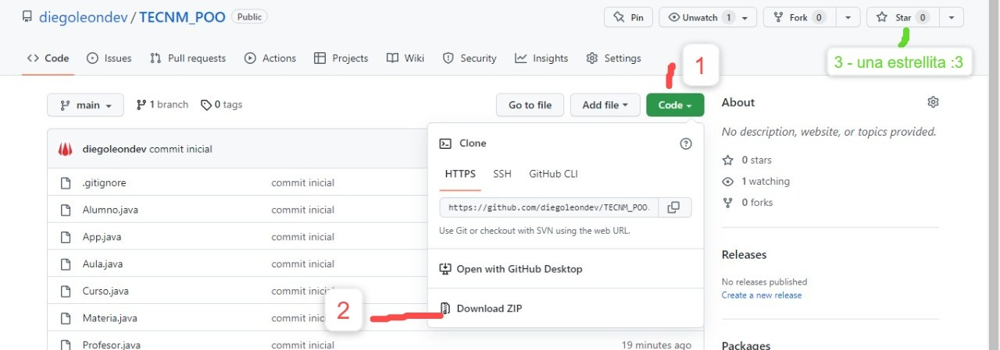

# ¿Cómo descargar? 🤔



1. Haga clic en `code`
2. Haga clic en `Download ZIP`

Como paso opcional puede dar una `⭐` al pryecto, Me motiva a seguir compartiendo código.

## ¿Cómo ejecuto el Proyecto?

1. Ubique la consola en la carpeta del proyecto, use el comando `cd`.

```
  cd C:/User/Docs/MyProyecto
```

> **Note**
> Use el comando `dir` para enumerar los archivos en la carpeta, verifique si está en el lugar correcto.

2. Use el comando `javac *.java` para compilar todos los archivos `java`.

```
  javac *.java
```

> **Warning**
> Para ejecutar este comando tienes que estar en la carpeta del proyecto (paso 1).

3. Use el comando `java App` para ejecutar el proyecto.

```
  java App
```

## Que te Diviertas 👩‍💻!!
